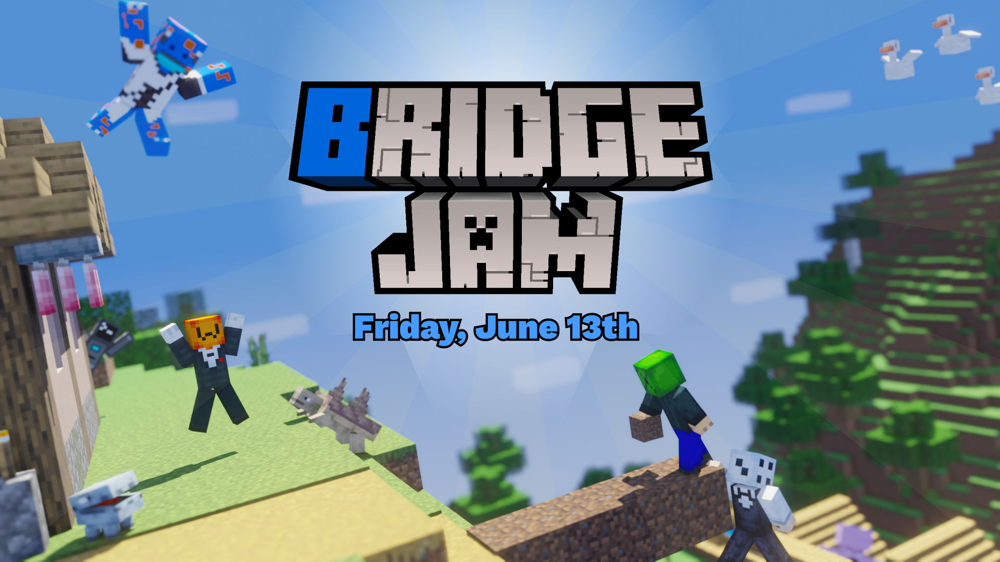

The bridge. jam is an event in which add-on creators have a 10 days to create an add-on themed around a chosen theme! The jam will take place on Friday, June 3rd to 13th.

# Theme: **The World Is Your Enemy**
Feel free to interpret this however you like.

## Why join the bridge. jam?

The bridge. Jam will be a fun experience where you can test your skills against other creators! The bridge. jam will also be a good opportunity to team up with other creators, to create an add-on together!

# What You Need To Know:

## Who Can Enter?

Anyone, any age, anywhere can enter! You can work alone or in teams!

## How Will Addons Be Rated?

Add-ons will be rated in three different categories: Fun, Polish, and Originiality with an overall score calculated as the average of the three categories. Each category will be rated out of 10. A selection of anonymous judges will rate all submissions. Then, the top 5 will be chosen and YOU the community will decide the winner!

## Are Teams Allowed?

YES! Teams are welcome, however you must specify if you worked in a team in your submission and give proper credit to the team!

## How do I Submit an Addon?

You can submit an addon by making a post to the jam-submissions channel of the [bridge. discord](https://discord.gg/Sde5VjbewB). Submissions must include the following:

1. A Title
2. A Description
3. A .mcaddon File
4. Was the add-on made with a team? If so, give credit.
5. **One** Image (Optional)

## What is the Theme?

The theme is **The World Is Your Enemy**!
Feel free to interpret this however you like. Original takes on the theme might help boost your submissions rating.

## When Will the Jam Take Place?

The jam will take place on Friday, June 3rd and run to Monday, June 13th.

## When Will Results Be Anounced?

Judges will take 3-4 days to judge all submissions. The community will then have 3 days to vote for a winner. Time will then be taken to setup winner anouncments and the proper prizes. In short and estimate of 2 weeks or 14 days after the jam finishes will be needed before anouncing the winners.

## What Will the Prizes Be?

The top 5 winners will have their addon featured on the main page of [the bridge, website](https://bridge-core.app/). The top winner of the whole jam will get free acsess to the private creator help channel of the bridge. discord for exclusive addon help. All winners will also be given a flashy new role in the server.

# Rules

**Breaking any of these rules will result in the add-on being disqualified!**

1. You are allowed to use any tools to create your add-on! However all assets used in the jam, must be created during the jam (this includes: textures, sounds, etc). You are allowed to use, or modify vanilla assets for your add-on!
2. You are allowed to use any presets, or compilers that may be avaliable inside of your chosen tool.
3. Your add-on must not contain any NSFW or offensive content.
4. Teaming up is allowed, and encouraged! However when submitting your add-on you must say that you have worked as a team, including crediting everyone on your team.
5. Only one submission per person.
6. Only make one post to the jam-submissions channel. If an edit is needed edit the original post.
7. Only use assets you have the right to use!
